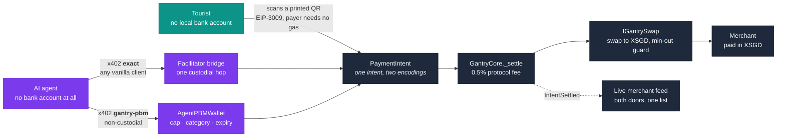
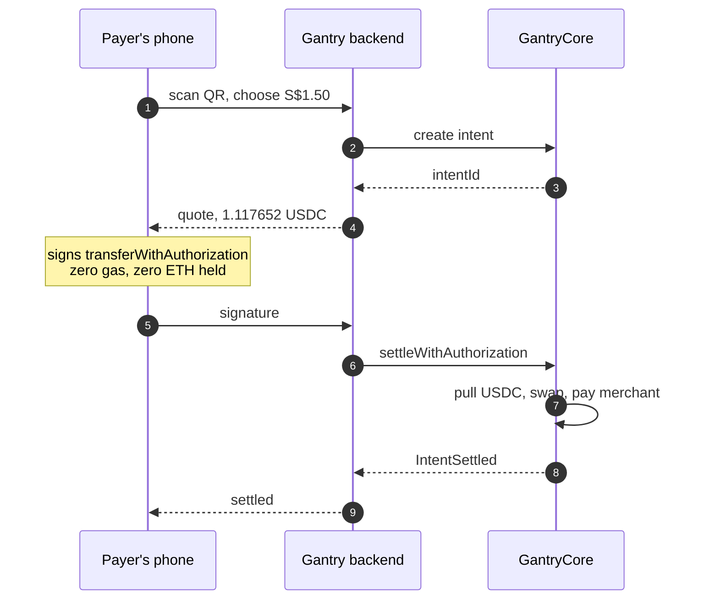
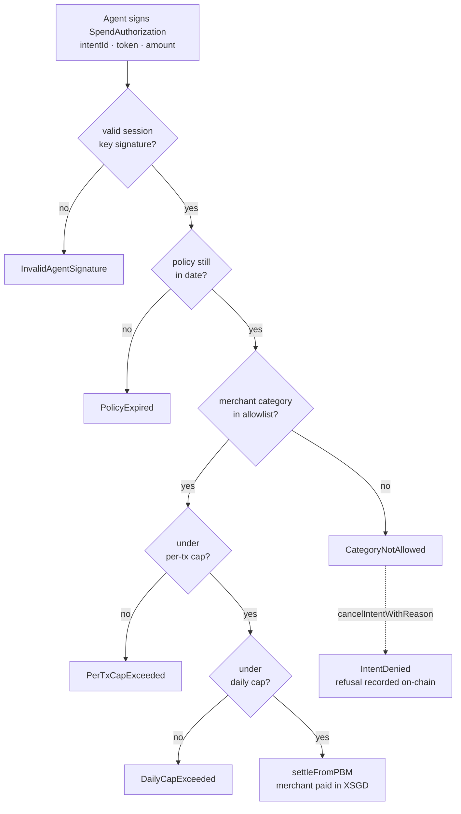

<p align="center">
  
</p>

<h1 align="center">Gantry</h1>

<p align="center">
  <strong>One rail, every payer: QR for humans, x402 for AI agents.</strong>
</p>

<p align="center">
  Base Sepolia · x402 v2 · gasless EIP-3009 · settles in XSGD
</p>

<p align="center">
  <a href="https://github.com/jagnani73/gantry/actions/workflows/ci.yml"></a>
  <a href="https://gantry-innovatex.vercel.app"></a>
  <a href="https://sepolia.basescan.org/address/0xE6289ceA9232af61d7e4F30A67a848c0C322cc93"></a>
</p>

---

Every payment system ever built assumes the payer is a human. Gantry is a payment rail on stablecoins where a merchant integrates once and gets paid by anyone: a tourist scanning a printed QR code, or an AI agent paying over the [x402 protocol](https://github.com/x402-foundation/x402).

Both are encodings of the same on-chain `PaymentIntent`, and both settle through the same contract. The merchant receives XSGD whatever token the payer sent, and never touches gas.

> **x402 standardized how machines pay. Gantry is the rail that lets one merchant accept payments from machines and humans alike.**

Built for [NTU InnovateX Hackathon 2026](https://ntu-cctf-snz-innovatex-2026.devpost.com/), Track 1: Payments & Financial Infrastructure.

|            |                                                                                                                                                                                                                                                                                                                                                                                             |
| ---------- | ------------------------------------------------------------------------------------------------------------------------------------------------------------------------------------------------------------------------------------------------------------------------------------------------------------------------------------------------------------------------------------------- |
| **Try it** | [Pay Ah Hock](https://gantry-innovatex.vercel.app/pay/ah-hock-chicken-rice) · [merchant back-office](https://gantry-innovatex.vercel.app/merchant/ah-hock-chicken-rice/overview) · [payer app](https://gantry-innovatex.vercel.app/app) · [merchant directory](https://gantry-innovatex.vercel.app/merchants) · [printable QR](https://gantry-innovatex.vercel.app/qr/ah-hock-chicken-rice) |
| **API**    | <https://gantry-backend.onrender.com> and [`/health`](https://gantry-backend.onrender.com/health), which reports the indexer cursor, chain head and lag                                                                                                                                                                                                                                     |
| **Deck**   | [Pitch deck (PDF, 10 slides)](docs/gantry-deck.pdf) — the problem, the architecture, both payer doors, and an explicit list of what is real and what is mocked                                                                                                                                                                                                                              |

<sub>The backend is a free Render instance, kept awake by an external health ping every 10 minutes. If that ping ever lapses, the first request after an idle period waits about 50s while the instance wakes.</sub>

## Why this exists

PayNow works well if you hold a Singapore bank account. Roughly 16 million people visit Singapore each year without one, and they fall back to cards at 2–3% merchant fees, or to cash.

AI agents have it worse, because they cannot open a bank account at all. [x402](https://github.com/x402-foundation/x402) launched in May 2025 and went to the Linux Foundation, with the x402 Foundation operational by July 2026, so agents finally have a standard way to pay. What they still lacked was anywhere to spend. That gap is what Gantry fills.

Agent money also needs rules rather than trust. Every spend here runs inside an on-chain allowance: a daily cap, a per-transaction cap, a merchant-category allowlist, and an expiry date. That is [MAS Project Orchid's Purpose-Bound Money](https://www.mas.gov.sg/schemes-and-initiatives/project-orchid) idea pointed at software instead of vouchers.

## How it works

1. A payment is an **intent**: _merchant M requests S$X_.
2. A QR code and an HTTP `402 Payment Required` response are **two encodings of the same intent**.
3. One settlement contract consumes both, atomically swapping whatever stablecoin arrived into XSGD.



The agent door has two sub-paths that differ in trust, drawn separately on purpose. Standard `exact` costs one custodial hop through the facilitator; `gantry-pbm` has none, because the payer's own wallet pays the merchant.

The merchant back-office shows a tourist's iced tea and an agent's bulk order landing in the same feed, in the same token, seconds apart. That convergence is the point.

## The human door

A printed static QR encodes `…/pay/<handle>`. The payer scans it, sees a price, and signs. No ETH, no wallet setup, no transaction of their own. The signature is an [EIP-3009](https://eips.ethereum.org/EIPS/eip-3009) `transferWithAuthorization`, and the relayer is what actually touches the chain and pays the gas.



The EIP-3009 nonce _is_ the `intentId`. That binding is what stops a signature being replayed against a different price or a different merchant.

## The agent door

The same order endpoint answers a machine with `402 Payment Required` and an x402 v2 `PAYMENT-REQUIRED` header. Its `accepts[]` offers two ways to pay:

| Scheme       | Who it's for                         | On-chain payer             | Custody                                                                                                                          |
| ------------ | ------------------------------------ | -------------------------- | -------------------------------------------------------------------------------------------------------------------------------- |
| `exact`      | Any vanilla x402 client, unmodified  | The relayer                | One hop, PSP-style. Spec clients generate their own EIP-3009 nonce, so a facilitator bridge collects the payment and re-signs it |
| `gantry-pbm` | Agents with an on-chain spend policy | The agent's own PBM wallet | None. The wallet pays the merchant directly                                                                                      |

An unmodified [`@x402/fetch`](https://github.com/x402-foundation/x402) client pays this endpoint end to end, which is the interop proof. The second path is the more interesting one.

### Spend policies that are contracts, not config

An `AgentPBMWallet` is deployed by the payer, from the payer's own key. They fund it, set its policy, and hold the only key that can change or revoke it. No server in this system can arm an agent or move its money. The agent gets a session key that signs spend requests and does nothing else.



Every refusal there is a contract revert, not a backend `if`. In the demo an agent holding a `food_beverage`-only allowance tries to buy a S$4 phone cable from an electronics merchant, comfortably inside every cap it has, and dies as `CategoryNotAllowed(2)`. The error name travels back to the agent verbatim as the x402 `errorReason`, and the refusal is written to the chain so the payer can see it in their app.

## Deployed on Base Sepolia

`eip155:84532`. All four contracts went out in one run and share a floor block of **45328301**.

| Contract                | Address                                                                                                  |                                                                                   |
| ----------------------- | -------------------------------------------------------------------------------------------------------- | --------------------------------------------------------------------------------- |
| `GantryCore`            | [`0xE6289ceA…C322cc93`](https://sepolia.basescan.org/address/0xE6289ceA9232af61d7e4F30A67a848c0C322cc93) | Merchant registry, intent lifecycle, dual-door settlement                         |
| `AgentPBMWalletFactory` | [`0x9e51484b…9b7Baac1`](https://sepolia.basescan.org/address/0x9e51484b1B79bB3E9EaCEfB3D3510Cc19b7Baac1) | Permissionless, so payers mint their own agent wallets                            |
| `FixedRateSwap`         | [`0xd84F8C46…D8311a0d`](https://sepolia.basescan.org/address/0xd84F8C46E7CAEA01188B6e27E8f1a07aD8311a0d) | Owner-set rate behind the `IGantrySwap` seam                                      |
| `MockXSGD`              | [`0xffebE173…a75e3503`](https://sepolia.basescan.org/address/0xffebE1735e22c274Ae30B2fBb3d4e422a75e3503) | Testnet mock, because real [XSGD](https://www.straitsx.com/) exists on no testnet |

Deploying them together is what lets the indexer sweep settlements, denials, merchant registrations and agent-wallet creations in a single `getLogs` pass over both addresses. Six event types in one topic filter cost what one would.

Payments settle in Circle's real testnet USDC ([`0x036CbD53…8f3dCF7e`](https://sepolia.basescan.org/address/0x036CbD53842c5426634e7929541eC2318f3dCF7e)), signed against Circle's own contract and fork-tested. Demo merchants `ah-hock-chicken-rice` and `gadgethub-sg` are registered on-chain.

> **Prototype scope.** The FX rate is owner-set rather than market-derived; the `IGantrySwap` interface is the part meant to survive, with real XSGD liquidity behind it in production. One relayer key pays all gas. Merchant registration is permissionless and self-attested, and nothing here reviews or verifies a merchant, which is why every badge reads _"Registered on-chain"_ and never _"Verified"_. A production deployment would operate under a licensed PSP within Singapore's Payment Services Act.

## FAQ

<details>
<summary><strong>Why not just use PayNow?</strong></summary>

For a Singaporean paying a Singaporean, you should. It is free and it works. PayNow needs a Singapore bank account, so it cannot serve the roughly 16 million international visitors who arrive each year, and it certainly cannot serve software. Gantry covers the payers PayNow structurally cannot reach, not the ones it already serves well.

</details>

<details>
<summary><strong>Why does this need a blockchain at all?</strong></summary>

The QR half doesn't, strictly. A bank could build it. The agent half does, for one specific reason: the spending policy has to be enforced somewhere the agent's own software cannot reach. A cap that lives in the agent's code is a cap a compromised agent edits. On-chain it is a revert, so the funds cannot move and you can watch it fail.

</details>

<details>
<summary><strong>What if the agent's session key is stolen?</strong></summary>

The attacker gets exactly what the policy allows: up to S$50 a day, at food merchants, until the expiry, and only until the owner revokes. The policy is the perimeter, not the key. That perimeter is not ours to move either, because `setPolicy` and `revoke` are `onlyOwner` and Gantry holds no key that can call them, so compromising Gantry does not widen an agent's allowance.

</details>

<details>
<summary><strong>Where does the FX rate come from?</strong></summary>

On testnet, from us. It is an owner-set fixed rate at 1.3421, labelled as such everywhere, because XSGD exists on no testnet. That is why settlement talks to an `IGantrySwap` interface rather than to a pool: production swaps in real XSGD liquidity through an aggregator or an RFQ quote. `GantryCore` enforces its own minimum-out by measuring its balance delta, so that guarantee does not depend on trusting whatever sits behind the interface.

</details>

<details>
<summary><strong>Where does the XSGD a merchant receives actually come from?</strong></summary>

A reserve. The deploy script minted 1,000,000 MockXSGD into `FixedRateSwap`, and every merchant is paid out of that balance; nothing is minted on demand. A settlement pushes the payer's USDC in and pulls XSGD out, so the pile only shrinks, and the USDC collecting on the other side is what `rescueERC20` exists to sweep. There is no curve and no slippage. The price is the owner-set rate, and a swap either pays in full or reverts, because an empty reserve just fails the ERC-20 transfer. Tokens without an owner-listed rate are refused outright, which is what stops anyone draining the reserve by offering it something they minted themselves.

We skipped the AMM on purpose. Seeding our own pool and pricing it through a curve would dress the same invented XSGD up as a market; a reserve labelled as a reserve claims less. `IGantrySwap` is the seam, and real XSGD liquidity is what goes behind it in production.

</details>

<details>
<summary><strong>Is agent commerce real, or speculative?</strong></summary>

Partly speculative, and we would rather say so than oversell it. What is not speculative: x402 launched in May 2025, went to the Linux Foundation, and its foundation was operational by July 2026 with 40 founding members including Google, Visa and Cloudflare. Client libraries ship today, and this endpoint is paid end to end by an unmodified one.

</details>

<details>
<summary><strong>Who carries the regulatory liability?</strong></summary>

Not Gantry, and we are not claiming otherwise. In production it sits behind a licensed payment institution under Singapore's Payment Services Act, the regime StraitsX already issues XSGD under. Gantry is the rail and the policy layer; the licensed entity holds the customer relationship and the obligations. A hackathon prototype is not a payments licence.

</details>

<details>
<summary><strong>There are no chargebacks. What about consumer protection?</strong></summary>

Correct, and that is a real limitation of settlement finality rather than something to hand-wave. Two partial answers. On the agent side the policy layer is preventive: the money never leaves, which beats clawing it back. On the human side a production deployment would put a licensed PSP in the flow who can hold funds in escrow for a dispute window. We did not build that.

</details>

<details>
<summary><strong>How does a hawker who has never held crypto actually get paid?</strong></summary>

Today the onboarding form asks for a payout address, which is the least realistic step in the whole flow. The production answer is a passkey smart account: the merchant creates a wallet with FaceID at signup, no seed phrase and no app to install, and Gantry never holds the key. What we deliberately did not do is generate and hold the merchant's key, which would make Gantry the custodian of hawker revenue and turn a non-custodial rail into an unlicensed money service.

</details>

<details>
<summary><strong>Did you write the x402 client?</strong></summary>

No, and that is the point. We wrote the server and the facilitator. The client is `@x402/fetch`, unmodified.

</details>

<details>
<summary><strong>Is the LLM making the payment?</strong></summary>

No. The model chooses and narrates. The signing and the HTTP live in tools it cannot reach, and if the model times out, a scripted path sends identical wire traffic.

</details>

---

# For developers

Everything above is the product. What follows is how to run it.

## Repo layout

A pnpm monorepo, five packages:

| Package              | Role                                                                                                                                                                             |
| -------------------- | -------------------------------------------------------------------------------------------------------------------------------------------------------------------------------- |
| `packages/contracts` | Foundry. `GantryCore`, `AgentPBMWallet` and its factory, `FixedRateSwap` behind `IGantrySwap`, EIP-3009 mocks. 191 tests, including policy fuzzing and real-USDC fork tests.     |
| `packages/shared`    | The single source of truth both halves import: generated ABIs, contract addresses, ceil quote math, EIP-712 typed-data builders, structural error decoding, x402 wire types.     |
| `packages/backend`   | Express and viem. Merchant API, the relayer (the only gas key), the SSE indexer, paged history, and a self-hosted x402 facilitator serving both schemes.                         |
| `packages/web`       | Next.js 15. Landing page, merchant directory, onboarding, the merchant back-office, the payer app, the payer page and the printable standee.                                     |
| `packages/agent`     | The LLM agent CLI, running Gemini through the Vercel AI SDK with a visually identical scripted fallback. Tools do the HTTP and the signing; the model only decides and narrates. |

Two surfaces, one rail. The merchant back-office at `/merchant/[handle]/…` is what a hawker leaves open on the counter, and the payer app at `/app/…` is where a payer's wallet, history and agents live.

## Run it locally

Needs Node ≥ 22.18 and pnpm 11 (`corepack enable` picks up the pinned version). Foundry is only needed for contract tests, since the ABIs are committed.

```bash
git submodule update --init                              # forge-std, contract tests only
pnpm install                                             # must precede any forge command
cp packages/backend/.env.example packages/backend/.env   # RPC URL, relayer key
cp packages/web/.env.example packages/web/.env.local     # point NEXT_PUBLIC_* at your LAN IP
pnpm dev                                                 # backend :4000 + web :3000
```

Every variable is documented inline in the `.env.example` files, which are the only reference for them.

Nothing needs deploying, because the contracts are live and their addresses ship in `@gantry/shared`. The relayer address does need Base Sepolia ETH and USDC: it is the only gas key in the system, and it doubles as the funder that tops up demo payers and agent wallets.

```bash
pnpm demo:reset                            # provision a rehearsal: funds, merchants, agent policy
pnpm --filter @gantry/backend e2e:pay      # human door, end to end
pnpm --filter @gantry/backend x402:buy     # vanilla @x402/fetch pays the agent door
pnpm --filter @gantry/agent   e2e:pbm      # the LLM agent pays through its policy
```

For the phone demo, put the phone on the same Wi-Fi, set `NEXT_PUBLIC_APP_URL` and `NEXT_PUBLIC_BACKEND_URL` to `http://<laptop-LAN-IP>:<port>`, then open `/qr/ah-hock-chicken-rice` and scan. Setting `NEXT_PUBLIC_DEMO_KEY` to a private key offers an in-browser demo account that the backend auto-funds, so a payer needs no wallet at all. Leave it unset and visitors connect their own.

## Tech

Solidity ^0.8.24 (Foundry) · Base Sepolia · x402 v2 · EIP-3009 gasless authorizations · viem and wagmi · Next.js 15 · Node 22 and Express · SQLite · Vercel AI SDK with Gemini

---

<p align="center">
  Yashvardhan Jagnani · <a href="https://github.com/jagnani73">@jagnani73</a> · Nanyang Technological University
</p>
