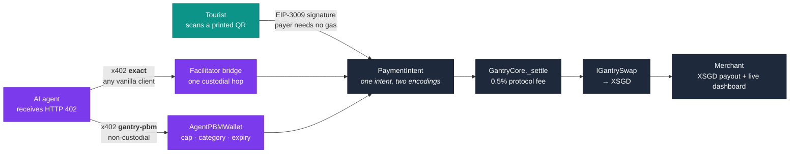

# Gantry — architecture

*Stage 1 submission artifact. Export the diagram below to PNG for Devpost; keep it legible at thumbnail size.*

## One rail, two doors

The convergence is the thesis. A QR code and an HTTP `402 Payment Required` response are two encodings of the same on-chain `PaymentIntent`; both settle through the same `_settle` path, and the merchant sees one feed.

## Callout 1 — the FX seam is the product, the pool is not

`GantryCore` never talks to a specific exchange. It talks to `IGantrySwap`, and enforces its own minimum-out by measuring its XSGD balance delta across the call.

- **Demo (Base Sepolia):** `FixedRateSwap`, an owner-set rate seeded at 1.3421. Honest label: this is not a market. No oracle, no slippage, no depth.
- **Production:** real XSGD liquidity on a supported mainnet through an aggregator or an RFQ quote, optionally bounded by a Chainlink SGD/USD sanity check. Same interface, same min-out guard, same settlement path.

An AMM was deliberately **not** built: a self-seeded toy pool is no closer to real FX than a fixed rate, and it would have cost days. A moving rate would also have needed a short-lived quote pin, since the x402 middleware requires the quote to stay byte-identical between the 402 challenge and the retry — solvable, but work spent making a fake pool behave rather than on either door.

## Callout 2 — the two agent sub-paths differ in trust

They are drawn separately on purpose.

| | `exact` (x402 standard) | `gantry-pbm` (Gantry scheme) |
|---|---|---|
| Who pays on-chain | the relayer | the `AgentPBMWallet` |
| Custody | one hop: agent → relayer → core | none |
| Client | any unmodified x402 client | Gantry session-key signer |
| Spend policy | none | on-chain caps, categories, expiry |

Why the hop exists: spec-compliant x402 clients generate their own random EIP-3009 nonce, while `GantryCore` requires `nonce == intentId` to bind a signature to one intent. Rather than fork the client, the facilitator collects the agent's authorization and re-signs an intent-bound one. That buys real standards interop — an unmodified `@x402/fetch` pays Gantry today — at the cost of a PSP-style custodial moment, which is disclosed rather than hidden.

## What runs where

| Layer | Stack | Notes |
|---|---|---|
| Contracts | Solidity ^0.8.24, Foundry | `GantryCore`, `AgentPBMWallet` + factory, `FixedRateSwap`, mocks. 162 tests incl. fuzz + real-USDC fork tests |
| Backend | Node 22, Express 5, viem | merchant API, relayer (sole gas key), x402 facilitator (`/verify` + `/settle`), SSE indexer |
| Web | Next.js 15, Tailwind, wagmi | onboarding, payer page, printable QR, merchant dashboard |
| Agent | Vercel AI SDK + Gemini `gemini-flash-latest` | terminal CLI; tools do all HTTP and signing, the model only decides and narrates |
| Chain | Base Sepolia `eip155:84532` | contracts verified on Basescan |

## Deployed contracts (Base Sepolia)

| Contract | Address |
|---|---|
| `GantryCore` | `0x6F02501ed28Fe918b04fC285404C615f4Ab25Ce0` |
| `AgentPBMWalletFactory` | `0x172905F26F09b41636854338360315971240c1cf` |
| `AgentPBMWallet` (demo) | `0xDD4bbed78B64715288bf10fabB2b62c659299D3E` |
| `FixedRateSwap` | `0xEdcD7AcABb610543e1626F4453c9c4Ec8ABab713` |
| `MockUSDC` | `0x5F7F058F2B1572524d1E3E740656CfAd1Ab011F9` |
| `MockXSGD` | `0xd583FaB0Db5c543f5574780f8b899AEb74463361` |

Primary pay token is Circle's real testnet USDC (`0x036CbD53842c5426634e7929541eC2318f3dCF7e`), which settlement is fork-tested against.
